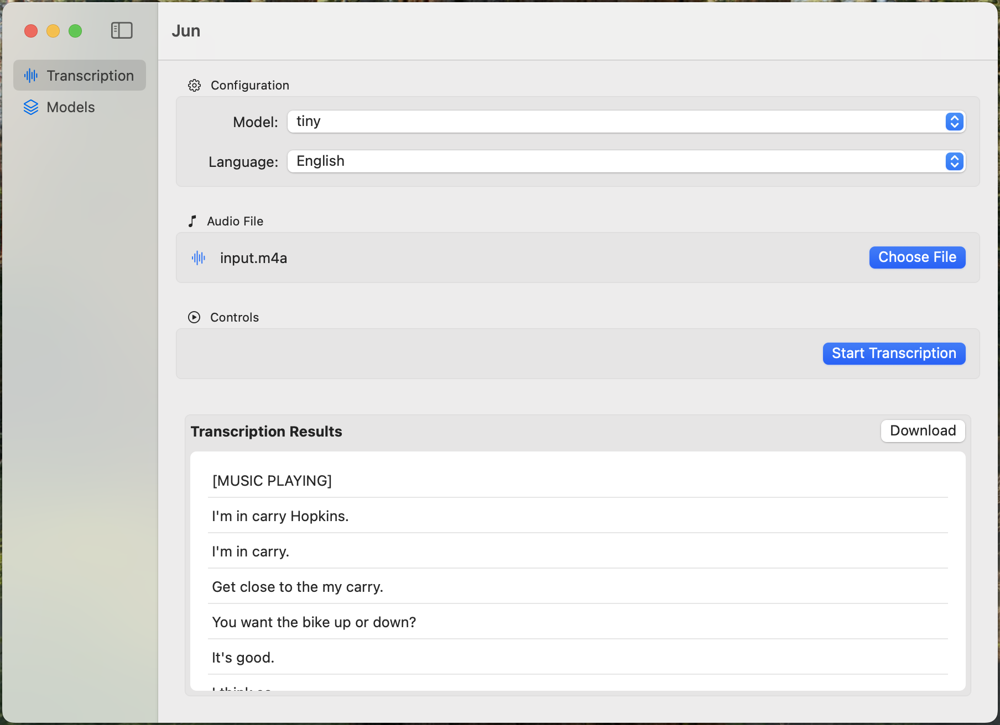
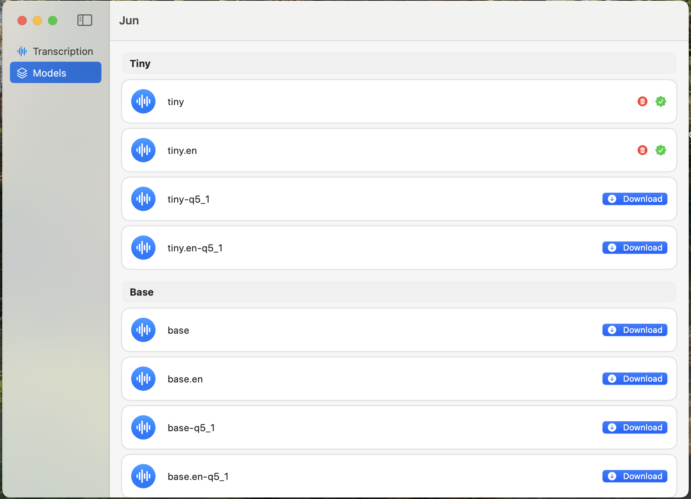

# Jun

## Overview

Jun is a macOS application designed to provide advanced audio transcription capabilities. The project leverages the `whisper.cpp` package for its core transcription functionality.

## Features

- **High Accuracy**: Utilizes state-of-the-art transcription algorithms.
- **User-Friendly Interface**: Intuitive and easy-to-use design.
- **Fast Processing**: Efficiently handles large audio files.

## Screenshots

    
    

## Dependencies

- **whisper.cpp**: A package used for audio transcription.

## License

This project is licensed under the MIT License. See the [LICENSE](LICENSE) file for details.

## Contributing

Contributions are welcome! Please open an issue or submit a pull request.

## Contact

For any inquiries, please [contact me](mailto:jiacheng.mao@outlook.com).

## Acknowledgements

- Thanks to the developers of `whisper.cpp` for their amazing work.
- Special thanks to Jun.

## Support

If you find this project useful, please consider giving it a star ⭐ on GitHub.

You can also support me by buying me a coffee:

Thank you for your support!
